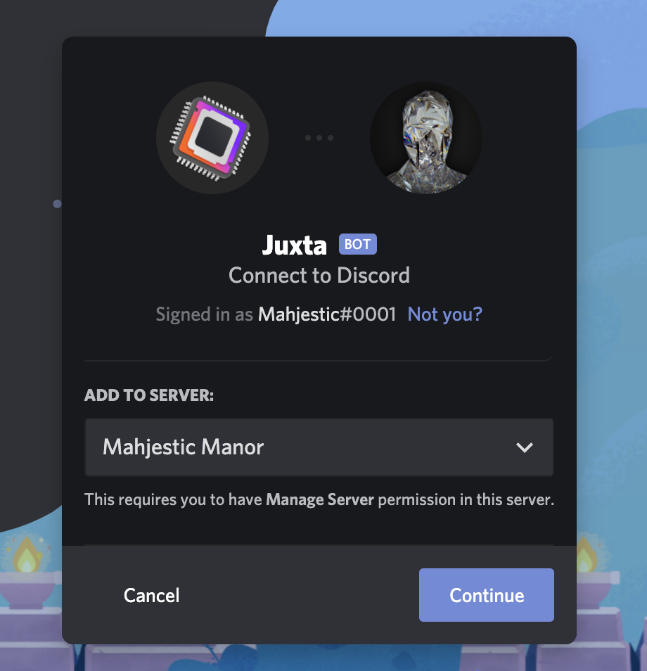

### **DISCLAIMER**
This documentation is nowhere near done. 
   
# Initial setup
You've finally decided that you want Juxta running your server. Splendid. Firstly, you'll have to [add the bot](https://discord.com/oauth2/authorize?client_id=837168587746705468&permissions=4294967287&scope=bot).

## Setup prompt
When the bot is in the server, run `-setup` in any channel to begin using the setup wizard. Here, you will enable, disable, and setup bot features.